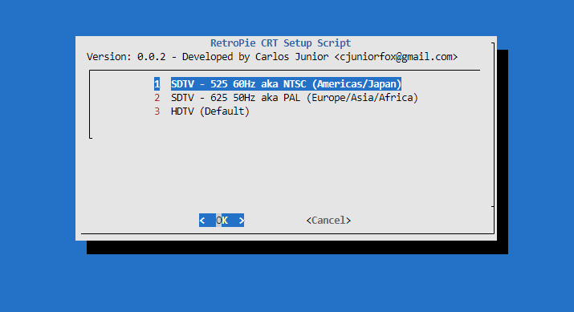

# retropie-crt
This project enables Raspberry Pi with Retropie to work with the native display modes for the emulated content. It manages things like scanline configuration (progressive or interlaced), refresh rate and pixel aspect ratio.
## Disclaimer

The Raspberry Pi it's an amazing device highly customizable.

Bundled with Raspberry Pi OS, the basis of the Retropie distribution, it haves a tool called "vcgencmd" which allows customizing the video output settings in a detailed way. It's possible to set technical parameters, like sync pulse interval or pixel aspect ratio, it's allowing to represent the original behaviour of the emulated content at the intended CRT faithful as possible.

Those scripts manage the "vcgemcmd" tool making the needed calculations and switching modes on the fly. Meaning that when you're browsing over the Emulationstation, the display settings will be optimized for that content, displaying at a standard resolution of 640x480i at 60Hz, or 640x576 at 50Hz, if the "aka PAL settings" was enabled. While managing to have the display outputting the proper settings for the target emulated platform.

But, how do I connect the Raspberry Pi to a CRT display using the HDMI output?

To manage that, it's needed to have two things.

A CRT display that is capable of managing the standard video modes with the proper inputs, like RGB or YPbPr and a converter box from HDMI to the desired connection like an HDMI to YPbPr (component) or HDMI to RGB SCART.

Most television sets manufactured for the American market in the early 2000 tend to have the component YPbPr inputs. Important to say that I'm not talking about only North America, but the whole American continent. If we talk about the European market, the set from the same period tends to have the SCART input connection, allowing the same purpose, but changing the connection and the colour space.

I tested with a cheap Chinese HDMI to YPbPr converter brought from Aliexpress. I believe that other converters, like HDMI to VGA or HDMI to SCART will also work as well. Be aware that if you're wanting to use an HDMI to VGA adapter for outputting to a CRT VGA Display, the intended display must be capable of handling the 15Khz signal. In a near future, I can manage to add the 31Khz support. But currently, it's not supported.

The set of scripting basically it's composed of two python scripts. The "chvideo.py" and "consoledisp.py".

### chvideo.py

This script drives the "vcgencmd" for outputting the desired video mode accordingly with the desired specs, like horizontal resolution, scanline mode and refresh rate. It does the calculation needed for the intended video settings.

### consoledisp.py

This one has all the intended modes and manages the customizable settings for the target platform emulated. Driving the "chvideo" script.

## Requiriments

* A Raspberry Pi. Tested at the Raspberry Pi 3. Far as the "vcgemcmd" tool exists, it should work.
* Retropie installed.
* An HDMI to analog display signal converter. Be aware that it needs to be a simple converter without any video processing. Just search for "HDMI to YPbPr" or "HDMI to VGA"  in any online Chinese store.

## Initial setup

* Enable the SSH at raspi-config as [described here](https://retropie.org.uk/docs/SSH/).
* From the same network and any command-line tool like Terminal or CMD, copy and paste the commands below.
> ssh pi@retropie 'bash <(curl -s https://raw.githubusercontent.com/cjuniorfox/retropie-crt/main/setup.sh)'
* Type the Raspberry's password if asked. The default password generally it's 'raspberry'.
* The automated tool will install all the files needed. Then finishes, a new option will be available from the Emulationstation's Retropie option menu called 'RETROPIE-CRT'.It isn't, will be needed to restart the Emulationstation.
* A new option will be available from the Emulationstation's Retropie option menu called 'RETROPIE-CRT'. To enable the CRT display settings, go to that option and enable the desired display mode between 625 50Hz (aka PAL), 525 60Hz (aka NTSC) or switch back to HDMI mode choosing HDTV.

Important: Don't plug the Raspberry into the CRT display before applying the configuration unless knowing if your set it's capable to handle HDTV signals, with the risk of harming the set deflection circuitry if you do so.

## Configuring the CRT Television modes.

At the first setup, keep your Raspberry connected to an HDTV-capable display over the HDMI and follow the steps below.

.With the gamepad, navigate to the Retropie Menu and then, choose "RETROPIE-CRT" options menu.

Choose the most appropriate option for your needs. You have three options.

- SDTV - 525 60Hz aka NTSC (Americas/Japan) - It's the common option to play most of the systems as if you're emulating an American or Japanese set.
- SDTV - 625 50Hz aka PAL (Europe/Asia/Africa) - Enables the PAL mode, to run at 50 Hz sets.
- HDTV - Unsets the whole configuration and makes the HDMI behave as default. Be aware this option does not uninstall the tool itself but just switches back the configuration of Raspberry's HDMI output.

# CHANGELOG

- Fixes some texting
- Added minimal support for users with composite video mode.